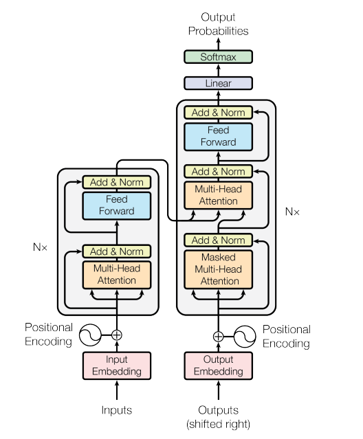
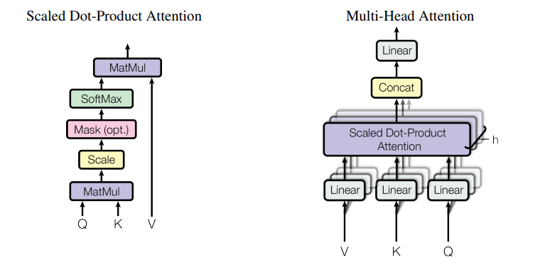
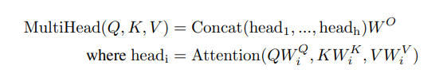
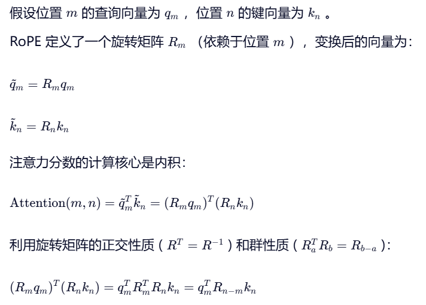
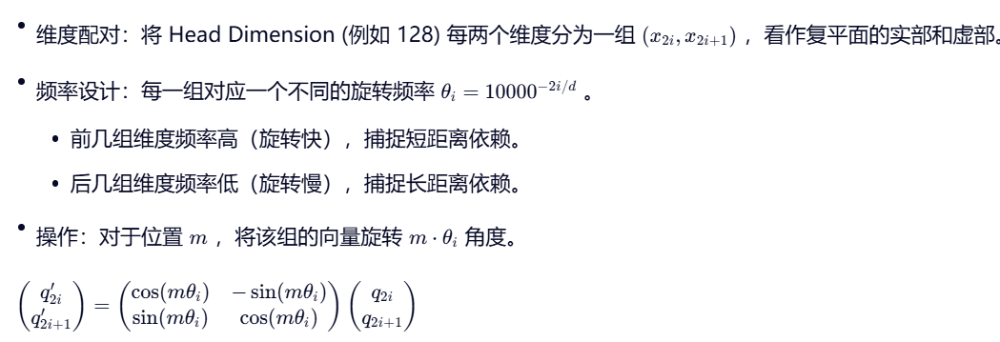
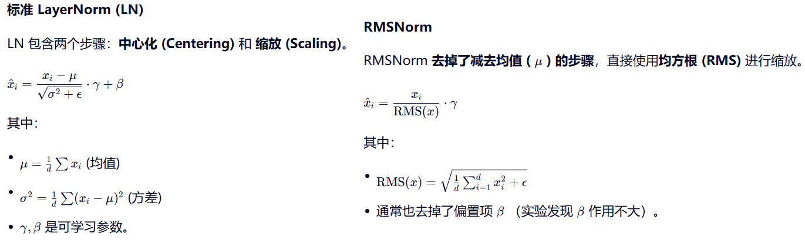

# Transformer篇

**[Attention is All You Need](https://arxiv.org/pdf/1706.03762)**

**1. 什么是 Transformer？介绍一下 Transformer 的结构**

Transformer是Google提出的**完全基于自注意力机制**的序列建模模型，**抛弃了传统的RNN/CNN**，依靠Self-Attention实现**并行计算和长距离依赖**建模。是现在所有大模型的基础架构。

Transformer的**整体结构**分为**Encoder**(编码器)和**Decoder**(解码器)两大部分。两者都由多层堆叠，编码器用于理解输入序列，解码器用于生成输出序列。

整体流程：

1. 将输入进行Tokenizer分词并转为词向量和加上位置编码
2. 交给Encoder层层提取特征，理解输入的含义
3. Encoder处理完的结果给到Decoder，它一边看Encoder理解好的内容，一边预测下一个词生成输出
4. 通过全连接层和Softmax，输出每个位置最可能的词

**2. 具体介绍一下各个组成部分？**



输入层：Embedding+位置编码

Encoder包含两个子层：

1. 多头自注意力层（双向注意力，看到**整个输入序列**）
2. 前馈网络FFN

两个子层都使用了残差连接与LayerNorm

Decoder包含三个子层：

1. 带掩码的多头自注意力（只能看到**当前及之前的token**）
2. 编码器-解码器注意力（Q来自Decoder，K、V来自Encoder **生成时关注输入序列**）
3. 前馈网络FFN

三个子层都使用了残差连接和LayerNorm

输出层：线性层+Softmax 

总体来说Transformer的核心组件包括Self-Attention, Positional Encoding, FFN和Normalization

**3. 介绍一下常见的Transformer衍生架构**

+ **Encoder-only**：基于**双向自注意力**，充分捕捉上下文语义，适合需要“理解输入”的任务。代表模型是`BERT, RoBERTa, ALBERT`。典型任务是文本分类、情感分析等
+ **Decoder-only**：基于**单向掩码自注意力**，天然适配“自回归生成”，适合需要“生成输出序列的任务”。代表模型是`GPT-1/2/3, LLaMA, Qwen`。典型任务是文本生成、机器翻译等
+ **Encoder-Decoder**：Encoder做源序列理解，Decoder做目标序列生成，通过**编码器-解码器注意力**建立源-目标序列的关联，跨序列的语义映射能力强。适合源和目标为不同序列的转换任务。代表模型是`T5, BART`等。典型任务是机器翻译、文本摘要、语音识别等

**4. Transformer对比RNN/CNN架构的优缺点是什么？**

Transformer的核心优势是**长距离依赖建模**、**训练效率高，天然并行**、**特征表示更灵活**。（这里也可以问做**为什么用Self-Attention?**）

+ **长距离依赖**：RNN是串行计算，词与词的依赖会随序列变长而衰减，LSTM/GRU只能缓解；CNN靠卷积核建模依赖，核大小有限，长距离依赖需要多层堆叠效果差；**Self-Attention直接计算任意两个词的关联，距离不影响建模能力**
+ **训练效率高、天然并行**：RNN必须按序列顺序计算完全无法并行；CNN能局部并行，但长序列仍需逐层滑动；**Transformer对所有token的计算是同时进行**，无时序依赖，可充分利用GPU算力
+ **特征表示更灵活**：RNN/CNN的特征提取是固定路径；Self-Attention的**注意力权重是动态学习的**，不同句子、不同语境下，词与词的关联权重会变化，能适配更复杂的语义。

Transfomer的核心缺点是**短序列/局部结构建模不够直观**、**长序列计算成本高**、**无固有时序信息，依赖额外位置编码**。

+ **短序列/局部结构建模不够直观**：CNN靠卷积核天然捕捉局部相邻特征；RNN也按时序关注局部；Transformer是全局注意力，对局部特征的捕捉需要靠模型学习，初期训练成本较高
+ **长序列计算成本高**：Self-Attention计算n个token之间两两之间的注意力，计算量和显存占用随序列长度平方级增长$O(n^2)$， RNN是$O(n)$，CNN是$O(n* k)（k为卷积核大小）$

+ **无固有时序信息、依赖额外位置编码**：RNN/CNN结构自带时序（RNN按顺序，CNN按滑动窗口）；Transformer必须手动加位置编码才能区分token顺序。



**5. 介绍一下Attention机制的原理？**

Attention机制就是模拟人类**聚焦关键信息**的能力，核心是先定义Q查询、K键、V值三个向量，以Q为核心计算和所有K的相似度，把相似度归一化得到注意力权重，最后用权重对V加权求和，得到了聚焦于关键信息的输出；他的优势是能动态分配权重，比池化更精准捕捉语义关联。

**6. Self-Attention为什么需要缩放点积（进行开根号）？**

Self-Attention的公式为 $Attention(Q,K,V) = softmax(\frac{QK^T}{\sqrt{d_k}})V$，缩放点积是为了防止**点积过大**直接送入softmax结果趋向于0或1，导致**softmax的导数几乎为0**，产生梯度消失现象，模型无法训练。

**7. 为什么Self-Attention的实现中，softmax的维度是dim=-1?**

因为在权重矩阵中，**每一行代表一个Query对所有Key的注意力权重分布**，我们要确保对于每个特定的Query，它对所有输入token的**权重之和为1**

**8.  自注意力机制的计算复杂度怎么算 结合公式讲一下**

自注意力的整体时间复杂度为$O(n^2*d + n* d^2)$ 其中n是序列长度， d是token的特征维度 核心耗时为$O(n^2*d)$，也是自注意力长序列计算成本高的根本原因。Self-Attention的公式是$Attention(Q,K,V) = softmax(\frac{QK^T}{\sqrt{d_k}})V$，计算的

**9. 介绍一下Multi-Head Attention? 他为什么有效？**

Multi-Head Attention是对原始Self-Attention的扩展升级，它把QKV拆分成多个头，每个头单独计算自注意力，最后把所有头的结果拼接、线性投影得到最终输出。

Multi-Head Attention有效的原因主要有3个：首先多头能学习到不同的注意力模式，特征更全面；第二，通过拆分多头降低单头注意力的维度压力，降低计算复杂度的同时提升效率和精准度；最后单头注意力容易出现偏见，比如过度关注某个位置的token或只捕捉到某一种关联，多头注意力的投票式整合使得模型对不同语境、序列的适配性更强，鲁棒性更高。

**10. 多头注意力的头数为什么不能太多/太少？**

+ 太少：回到单头的问题，无法捕捉多重依赖，失去多头的意义；
+ 太多：每个头的维度过小，模型学习能力不足（比如维度太小，无法承载足够的信息），且计算量会线性增加，性价比降低；

**11. 你觉得多头注意力能提高计算效率吗，结合公式推导一下？如果不能，详细讲讲为什么？**



在模型总维度$dim$固定的前提下，多头注意力和单头注意力的计算复杂度完全一致，并不会直接提升计算效率，但能在不增加计算成本的前提下，大幅提升模型的特征建模能力。

自注意力的计算复杂度主要来自$QK^T$的矩阵乘法，Q/K的维度为[batch,seq,dim] 单头注意力的计算复杂度为$O(n^2 * dim)$

多头注意力的核心是**总维度拆分，分头计算，维度不变** $dim = h * d_k$, 此时的单头注意力复杂度为$O(n^2 * d_k)$ ，多头注意力的总计算复杂度为$O(n^2 * dim)$

从算法复杂度上多头和单头一致，但从**工程实现（GPU/硬件运行效率）**上多头能通过并行计算提升实际运行速度：

+ 单头是**单路高维计算**，GPU的并行算力无法充分利用（高维矩阵乘法的并行度受限）
+ 多头是**多路低维并行计算**，h个头的低维矩阵乘法能同时在GPU的多个计算核心上运行，实际训练/推理的耗时会比单头略低

但头数超过硬件并行算力上限时，多路并行会变成多路串行，且过多的投会带来拼接/线性投影的额外开销，并导致单个头的学习能力不足，模型效果下降。

**12. Transformer的FFN层能不能去掉，为什么**

FFN不能去掉，他是**和自注意力层互补**的核心组件。

+ FFN的结构是Linear => Activation => Linear，自注意力层是线性层，FFN通过激活函数**引入非线性**，去掉之后模型无法拟合复杂的自然语言；
+ 自注意力负责建模词之间的全局关联，FFN通过升维降维**对单个词的特征**进行提取
+ FFN是单token并行计算，与注意力层的高复杂度形成计算平衡，还能通过残差连接提升训练稳定性。

**13. 为什么Decoder-only成为大模型的主流架构，相比于encoder-decoder的优势在哪里**

Decoder-only成为大模型主流架构，核心是三个优势：首先**自回归生成范式**让训练和推理完全统一，工程实现简单，适配所有通用生成任务；第二，仅需解码器使得显存和算力效率更高，提升模型规模的边际成本较低；第三，**无监督预训练时数据利用率100%**，不用拆分源/目标序列。而Encode-Decoder仍在跨序列转换，非自回归生成场景占优。

**14. Transformer为什么需要位置编码？如果去掉会发生什么？**
  Transformer需要位置编码，是因为**Self-Attention机制本身是置换不变**的。如果去掉位置编码，模型将**无法区分词序**，把 “我爱你”和“你爱我”视为完全相同的输入，导致模型彻底散失理解语法结构、逻辑关系和语义顺序的能力。

注意力矩阵$A=softmax(\frac{QK^T}{\sqrt{d_k}})$只取决于token的内容向量点积，与他们在序列中的绝对位置无关。而后续的**FFN是对每个位置独立操作**的，它也无法捕捉位置信息。位置编码的核心思想是**将位置信息注入到输入Embedding中**。具有**唯一性、打破对称性、相对/绝对关系**。


> 打破对称性：即使两个词的内容相同，加上不同位置编码后他们的输入向量也变得不同

**15. 原始Tranformer使用的是绝对位置编码，为什么后来的模型都转向了相对位置编码？**

使用绝对位置编码模型需要显示学习i和j的具体位置，如果训练时最大长度是512而推理时遇到1024，模型完全没见过位置513-1024的向量，由于**外推性**极差性能崩塌。

相对位置编码的核心思想是**语言的理解更多依赖于词与词之间的距离**，而不是他们在句子中的绝对序号。它天然具有更好的泛化能力。只要学会了**“距离为k”的注意力模式**，无论序列多长距离为k的词都能正常交互。相对位置编码为模型引入了一个强大的**归纳偏置：平移不变性**。这减少了模型需要学习的参数量，提高了数据效率，使得模型在有限的时间下能更快的收敛到更好的解。

**16. 请详细解释 RoPE 的原理。它是如何实现相对位置编码的？**

RoPE结合了绝对位置编码和相对位置编码的优点。它的核心思想是**用旋转代替相加**。传统方法将位置向量直接加到词向量上。而RoPE的思路是：将位置信息m编码为旋转矩阵$R_m$，作用于查询向量q和键向量k。



在实际代码中，不会真的去乘巨大的矩阵，而是利用**复数性质**或**三角函数**在向量维度上操作：



**17. 为什么RoPE成为大模型位置编码的主流选择？**

1. RoPE既有**相对位置编码的外推性**（适合长文本），又**保留了绝对位置信息**（q,k本身被旋转了，不同位置的向量方向不同），能区分句首和句尾
2. 不需要像可学习位置编码那样增加额外的Embedding参数
3. 只是**简单的主元素乘加**，极易GPU并行，且与Flash Attention完美兼容
4. 配合NTK-aware插值技术，可以低成本地将训练好的模型上下文从4k扩展到32k、128k甚至更长而无需重新全量训练

**18. Masked Multi-Head Attention中的Mask是怎么做的？在训练和推理时有什么区别？**

Masked Multi-Head Attention的Mask分两类：**Look-ahead Mask**是构造上三角矩阵填充-inf，屏蔽未来信息；**Padding Mask**是扩展维度后填充-inf，屏蔽padding。**训练时两类Mask都显式叠加**，因为是并行输入完整序列；推理时逐token生成，天然看不到未来信息，所以**无需Look-ahead Mask**，仅需Padding Mask处理padding，同时复用KV cache提升效率，核心都是保证模型只关注有效、已生成的信息。

```python
import torch

# 构造上三角矩阵 (加到QK^T/sqrt(d_k)上)
def create_look_ahead_mask(seq):
    mask = torch.triu(torch.ones(seq,seq),diagonal=1)
    # [seq,seq] 将1转为-inf
    mask = mask.masked_fill(mask==1,float('-inf'))
    return mask.unsqueeze(0).unsqueeze(0) # [1,1,seq,seq]

def create_padding_mask(seq):
    # seq: [batch,seq_len], 0表示padding
    mask = (seq==0).unsqueeze(1).unsqueeze(2) # [batch,1,1,seq_len]
    return mask.float().masked_fill(mask==1,float("-inf"))

# 推理时KV Cache的简化逻辑（伪代码）
def decode_step(input_token, past_kv, padding_mask):
    q = linear(input_token)
    k = linear(input_token)
    v = linear(input_token)
    
    # past_kv[0].shape [batch, head_num, seq_prev, head_dim]
    current_k = torch.cat([past_kv[0],k],dim=-2)
    current_v = torch.cat([past_kv[1],v],dim=-2)
    
    attn_weight = q @ current_k.transpose(-1,-2)/sqrt(d_k)
    
    if padding_mask is not None:
        attn_weight = attn_weight.masked_fill(padding_mask==0, -inf)
    
    attn_weight = softmax(attn_weight)
    output_weight = attn_weight @ current_v
    
    return output, (current_k, current_v)
```

**19. 推理时KV Cache是如何工作的？它的显存占用怎么计算？**

KV Cache的核心目的是：**推理时避免重复计算历史token的K/V，仅计算新增token的K/V，大幅降低计算量和耗时**。

KV Cache需要缓存**每一层Decoder的K和V**(注：Encoder-only模型没有KV Cache, Decoder-only模型每一层都要缓存)，核心公式：（批量推理时需要另外乘以batch_size），显存占用**和序列长度L线性相关**
$$
显存占用(byte) = 2 \times num\_layers \times num\_heads \times head\_dim \times seq\_len \times bytes\_per\_param
$$
**20. Layer Normalization和Batch Normalization的区别是什么？为什么NLP主要用LN?**

BN和LN的核心区别在于**统计量计算的维度不同**：BN是在**batch维度**上对同一特征 进行归一化，而LN是在**特征维度**上对单个样本进行归一化。NLP领域主要使用LN，是因为它天然适应**变长序列**和**小Batch训练**（序列太长甚至batch size=1-BN失效）的场景，而这正是NLP数据的典型特征。LN**训练和推理一致**，都使用当前输入的样本的统计量，实现更简单和稳健。

**21. Pre-LN和Post-LN的优缺点对比？为什么大模型都转向Pre-LN?**

Post-LN的结构是`Sublayer->Add->Norm`，即$y = LayerNorm(x+F(x))$

Pre-LN的结构是`Norm->Sublayer->Add`， 即$y=x+F(LayerNorm(x))$

+ 梯度流动： Pre-LN的**梯度可以直接通过残差连接无损流向底层**（恒等映射路径）；Post-LN需要穿过F和LN，深层网络中容易导致梯度消失

+ 训练稳定性：Pre-LN更高，可以使用更多的学习率，甚至**不需要Warmup，支持训练数百/上千层**。Post-LN大于12层就很难训练 =>大模型转向Pre-LN

+ 收敛速度：Pre-LN较快，**初期即可使用较大的学习率**

+ 最终性能：Post-LN理论上更高（微小差距），Pre-LN的输入被归一化可能损失部分信息幅度，但在大模型规模下可忽略不计

  >更大的初始化缩放：在残差分支上乘以一个小于1的系数，或者在初始化时将最后一层权重设为0，让网络在初始阶段更接近恒等映射，进一步稳定训练。
  >
  >RMSNorm：计算更高效的RMSNorm能在保持Pre-LN稳定性的同时减少计算开销。
  >
  >现代最佳实践组合：**Pre-LN+RMSNorm+适当初始化**

+ 工程难度：Pre-LN更低，超参数鲁棒性强，易于大规模并行训练。

**22. RMSNorm比LayerNorm好在哪里？**

RMSNorm的核心思想是“**去掉均值中心化，只保留均方根缩放**”。LN假设数据分布需要被强制拉到均值为0，方差为1；RMSNorm假设数据分布只需要被缩放到合适的幅度，均值是多少并不重要。



RMSNorm比LayerNorm好的地方主要体现在3点：（**不牺牲模型性能**的前提下，通过**去除冗余计算**来提升训练和推理效率）

1. 计算更高效：省去了计算均值和中心化的操作。在大模型几十上百层的堆叠下对训练速度和推理延迟优化显著
2. 效果相当：在深层Transformer网络，**控制特征的尺度**才是归一化起效的关键
3. 实现更简洁：通常也去掉了偏置项β，减少了参数量

**Transformer是如何实现并行化计算的？**

Transformer实现并行化的核心是**彻底摈弃了RNN的时序串行依赖，讲序列维度的计算转化为矩阵级的全并行运算**，体现在三个核心模块：

+ 注意力层的Q/K/V层会一次性完成线性投影和矩阵乘法，直接计算出整个序列的注意力权重
+ 前馈网络FFN对每个token做独立的非线性变化，不同token之间无任何依赖关系
+ 输入层的嵌入与位置编码都可以通过查表和预定义/可学习的固定矩阵得到，无时序约束

**除了MHA还知道哪些Attention变体，讲讲他们的原理和使用场景？**


**手写一下SelfAttention**

```python
import math
import torch
import torch.nn as nn

class SelfAttention(nn.Module):
    def __init__(self, hidden_dim):
        super().__init__() # 不要遗漏
        self.hidden_dim = hidden_dim
        self.q_proj = nn.Linear(hidden_dim,hidden_dim)
        self.k_proj = nn.Linear(hidden_dim,hidden_dim)
        self.v_proj = nn.Linear(hidden_dim,hidden_dim)
    
    def forward(self, X):
        # X.shape [batch,seq,dim]
    	Q = self.q_proj(X)
        K = self.k_proj(X)
        V = self.v_proj(X)
        
        attention_weight = torch.matmul(Q,K.transpose(-1,-2))/math.sqrt(self.hidden_dim)
        attention_weight = torch.softmax(
        	attention_weight,
            dim = -1 # 重点
        )
        attention_value = attention_weight @ V
        return attention_value
    
# 进阶实现 padding mask/dropout
class SelfAttention(nn.Module):
    def __init__(self,dim,dropout_rate=0.1):
        super().__init__() # 不要遗漏
        self.dim = dim
        self.dropout = nn.Dropout(dropout_rate)
        
        self.q_proj = nn.Linear(dim,dim)
        self.k_proj = nn.Linear(dim,dim)
        self.v_proj = nn.Linear(dim,dim)
    
    def forward(self,x,mask=None):
        # x.shape [batch,seq,dim]
        Q = self.q_proj(x)
        K = self.k_proj(x)
        V = self.v_proj(x)
        
        # attention_weight.shape [batch,seq,seq]
        attention_weight = torch.matmul(Q,K.transpose(-1,-2))/math.sqrt(self.dim)
        if mask is not None: # 先mask再softmax
            attention_weight = attention_weight.masked_fill(
            	mask == 0,
                float('-inf') # softmax之后为0，直接填0那么softmax之后依然有权重分值
            )
        
        attention_weight = torch.softmax(
        	attention_weight,
            dim = -1 # 重点
        )
        
        attention_weight = self.dropout(attention_weight)
        output = attention_weight @ V
        return output
```


**手写一下Multi-Head Attention**

```python
import math
import torch
import torch.nn as nn

class MultiHeadAttention(nn.Module):
    def __init__(self, dim, head_num, dropout_rate):
        super().__init__()
        self.dim = dim
        self.head_num = head_num
        self.head_dim = self.dim // self.head_num
        
      	self.dropout = nn.Dropout(dropout_rate)
        
        self.q_proj = nn.Linear(dim,dim)
        self.k_proj = nn.Linear(dim,dim)
        self.v_proj = nn.Linear(dim,dim)
        self.o_proj = nn.Linear(dim,dim)
    
    def forward(self,x,padding_mask = None): 
        # x.shape [batch,seq,dim]
        batch, seq, _ = x.size()
        
        q = self.q_proj(x)
        k = self.k_proj(x)
        v = self.v_proj(x)
        
        # [batch,seq,head_num,head_dim] => [batch,head_num,seq,head_dim]
        q_state = q.view(batch, seq,self.head_num,-1).transpose(1,2) # 分头
        k_state = k.view(batch,self.head_num, seq, -1).transpose(1,2)
        v_state = v.view(batch, self.head_num, seq, -1).transpose(1,2)
        
        # [batch, head_num,seq,seq]
        # 重点 点积是在head_dim这个维度的向量上进行的，QK^T的方差与向量维度成正比，需要匹配。
        attention_weight = torch.matmul(q_state,k_state.transpose(-1,-2)) / math.sqrt(self.head_dim) 
        if padding_mask is not None:
            if padding_mask.dim() == 2:
                # 重点：假设输入为[batch,seq]，需要扩展为[batch,seq,1,1]以便广播
                padding_mask = padding_mask.unsqueeze(1).unsqueeze(2)
            attention_weight = attention_weight.masked_fill(padding_mask==0, float("-inf"))
        
        attention_weight = torch.softmax(attention_weight,dim=-1)
        attention_weight = self.dropout(attention_weight)
        
        # [batch, head_num,seq,head_dim]
        attention_value = attention_weight @ v_state # 重点：不要乘错了
        attention_value = attention.transpose(1,2).contiguous() # 细节：内存连续化
        attention_value = attention_value.view(batch,seq,-1) # 合并头
        
        output = self.o_proj(attention_value)
        return output
```

**为什么合并头时要使用.contiguous?**

transpose后的Tensor在内存中是不连续的（它只改变了步长映射）。而view操作要求Tensor并需在内存中连续，因此需要先.contiguous，否则会出现RuntimeError。