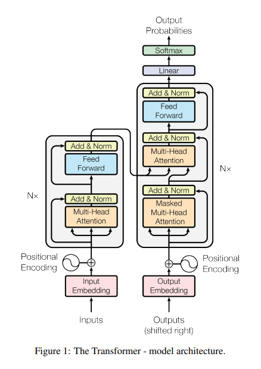

# Transformer篇

**[Attention is All You Need](https://arxiv.org/pdf/1706.03762)**

**1. 什么是 Transformer？介绍一下 Transformer 的结构**

Transformer是Google提出的**完全基于自注意力机制**的序列建模模型，**抛弃了传统的RNN/CNN**，依靠Self-Attention实现**并行计算和长距离依赖**建模。是现在所有大模型的基础架构。

Transformer的**整体结构**分为**Encoder**(编码器)和**Decoder**(解码器)两大部分。两者都由多层堆叠，编码器用于理解输入序列，解码器用于生成输出序列。

整体流程：

1. 将输入进行Tokenizer分词并转为词向量和加上位置编码
2. 交给Encoder层层提取特征，理解输入的含义
3. Encoder处理完的结果给到Decoder，它一边看Encoder理解好的内容，一边预测下一个词生成输出
4. 通过全连接层和Softmax，输出每个位置最可能的词

**2. 具体介绍一下各个组成部分？**

Encoder包含两个子层：

1. 多头自注意力层（双向注意力，看到**整个输入序列**）
2. 前馈网络FFN

两个子层都使用了残差连接与LayerNorm

Decoder包含三个子层：

1. 带掩码的多头自注意力（只能看到**当前及之前的token**）
2. 编码器-解码器注意力（Q来自Decoder，K、V来自Encoder **生成时关注输入序列**）
3. 前馈网络FFN

三个子层都使用了残差连接和LayerNorm

**3. 介绍一下常见的Transformer衍生架构**

+ Encoder-only：基于双向自注意力，充分捕捉上下文语义，适合需要“理解输入”的任务。代表模型是`BERT, RoBERTa, ALBERT`。典型任务是文本分类、情感分析等
+ Decoder-only：基于单向掩码自注意力，天然适配“自回归生成”，适合需要“生成输出序列的任务”。代表模型是`GPT-1/2/3, LLaMA, Qwen`。典型任务是文本生成、机器翻译等
+ Encoder-Decoder：Encoder做源序列理解，Decoder做目标序列生成，通过编码器-解码器注意力建立源-目标序列的关联，跨序列的语义映射能力强。适合源和目标为不同序列的转换任务。代表模型是`T5, BART`等。典型任务是机器翻译、文本摘要、语音识别等

**4. Transformer对比RNN/CNN架构的优缺点是什么？**