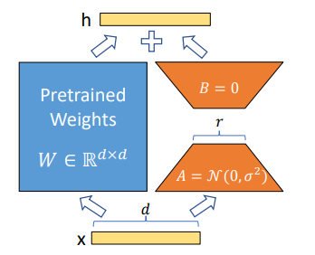

# 微调

**1. 什么是大模型微调？和预训练的区别是什么？**

微调是在**预训练大模型**的基础上，使用**小批量领域/任务专属数据**继续训练，让模型适配特定任务/场景的过程；本质是在**预训练的通识知识上，学习任务的专属模式**，仅更新部分或全部模型参数，**远低于预训练的计算成本**

**与预训练的核心区别**

| 维度       | 预训练                      | 微调                         |
| ---------- | --------------------------- | ---------------------------- |
| 数据规模   | 海量无标注 / 弱标注通用数据 | 小批量有标注任务 / 领域数据  |
| 训练目标   | 学习通用语言规律、知识表征  | 适配特定任务（如问答、摘要） |
| 参数更新   | 全量参数大幅更新            | 部分 / 全量参数微调更新      |
| 计算成本   | 极高（千亿参数量需超算）    | 低（单卡 / 多卡即可完成）    |
| 模型通用性 | 通用大模型，适配多任务      | 专用模型，仅适配目标任务     |

**2. 为什么要进行微调（Fine-tuning）？预训练模型不能直接用吗？**

- **领域适配**：预训练模型（Base Model）是在通用语料上训练的，缺乏特定领域（如医疗、法律、代码）的专业知识或术语理解。微调可以注入领域知识。
- **指令遵循（Instruction Following）**：Base Model 擅长“续写”，但不擅长“回答问题”或“执行指令”。通过 SFT（监督微调），可以让模型学会遵循人类指令的格式和逻辑。
- **任务特定化**：将通用的语言能力转化为特定任务能力（如分类、抽取、特定风格的生成）。
- **对齐人类价值观**：通过 RLHF 或 DPO 等后续微调阶段，减少有害输出，使模型更符合人类偏好。

**3. 大模型微调有哪些常见的方法？各自的适用场景是什么？**

根据**参数更新程度**可以划分为3类，相对应了不同的数据量、算力和任务复杂度的适用场景。

+ 全量微调(Full Fine-tuning)：更新模型**所有参数**，任务适配性最好，对算力要求高，易过拟合，需要大量标注数据
+ 参数高效微调(PEFT, Parameter-Efficient Fine-tuning)：仅更新模型**少量额外引入的参数**（原模型参数冻结），更新参数量仅占原模型的0.1%-5%，算力成本极低，不易过拟合，可**多任务共享底座模型**，代表方法：LoRA，Adapter, P-tuning v2, Prefix Tuning
+ 提示词微调(Prompt Tuning)：**不更新模型参数**，仅设计**专属提示词模板**（如少样本提示、思维链CoT），让模型适配任务

**4. 请详细讲讲 LoRA (Low-Rank Adaptation) 的原理。为什么它有效？**

LoRA 假设模型在适应特定任务时，权重的变化矩阵具有**低秩特性**。即大模型迁移到新任务所需的自由度远小于参数量。它在原始权重$W_0$旁并联两个低秩矩阵A和B$(W=W_0+BA)$，其中**A初始化为高斯分布，B初始化为0**。训练时冻结原始矩阵，只更新A和B。
$$
h = W_0 x + \Delta W x = W_0 x + B A x
$$
为什么有效：

+ 低秩假设：实证表明，大模型迁移到新任务所需的自由度远小于参数量。
+ 无推理延迟：训练完成后可以将低秩矩阵合并回原始矩阵，推理时无额外计算开销
+ 稳定性：由于固定了主权重，避免了灾难性遗忘，训练更稳定

**LoRA 应该加在模型的哪些层？Rank (r) 和 Alpha 怎么设？**

原始论文建议只加在Attention的q,v层，实践发现加在All Linear层（包括k,o, MLP层，甚至是Embedding层）效果通常更好，尤其是对于复杂推理任务。

> LLM 的知识**不仅存储在 Attention 中，MLP 层也承载了大量领域知识**。仅微调 q,v 可能**限制了模型的表达能力**，尤其是在复杂推理或代码生成任务中。

Rank(r)决定了**可训练参数的数量和模型的容量**，r越大拟合能力越强，但过拟合风险增加，显存微微增加。常见设置为8, 16, 32, 64 (r 越大参数量越多，但不一定线性提升效果，存在**边际递减**)

Alpha（$\alpha$）：相当于学习率的缩放因子，通常设为 2r或r 。学习率调整时需注意$\alpha$的影响 如果设置的很大，LoRA分支的更新幅度就大。LoRA 的输出缩放系数通常是 $\frac{\alpha}{r}$

**除了 LoRA，还了解哪些 PEFT 方法？**

- **Adapter**：在 Transformer 层之间插入小型的全连接网络模块。缺点是会增加推理延迟（无法像 LoRA 那样完美合并）。
- **Prefix Tuning / P-Tuning v2**：在输入序列前添加可学习的连续向量（Soft Prompt）。P-Tuning v2 将其推广到每一层，效果媲美全量微调。
- **QLoRA**：LoRA + 4-bit 量化。将基座模型量化为 4-bit (NF4)，在此基础上挂 LoRA。极大降低显存需求（单卡可训 70B 模型），是目前资源受限下的首选。

**估算一下，微调一个 7B 模型需要多少显存？（全量 vs LoRA）**

1. 模型权重：

   FP16/BF16: $7B × 2Bytes ≈ 14GB$

   4-bit(QLoRA)：$7B × 0.5Bytes ≈ 3.5GB$

2. 梯度：全量微调需存储所有参数的梯度 (FP32 或 BF16)，约等于参数量大小（若用 AdamW，需存动量等，更多）；LoRA 仅需存储 LoRA 参数的梯度（极小，可忽略）

3. 优化器状态（AdamW）：通常需要存储一阶矩和二阶矩（FP32），约为参数量的 8-12 倍（全量微调时）；LoRA 下仅针对 LoRA 参数，极小。

4. 激活值：与 Batch Size 和序列长度成正比，使用 Gradient Checkpointing 可大幅降低（以时间换空间）。

**全量微调 (7B, BF16)**：至少需要 **80GB+** 显存。经验公式：参数量 ×16~20 倍字节数

**LoRA 微调 (7B, BF16)**：约 **16GB - 24GB** 显存

**QLoRA 微调 (7B, 4bit)**：约 **10GB - 14GB** 显存

**什么是 Gradient Checkpointing（梯度检查点）？作用是什么？**

梯度检查点在反向传播时，**不保存所有中间层的激活值**（Activation），只保存部分关键节点的激活值。当需要计算某层梯度时，**重新向前计算**该段的激活值。

以大约 20%-30% 的**计算时间增加为代价**，换取 **显存占用大幅降低**（通常可减少 60%-80% 的激活显存），使得在有限显存下能训练更大的 Batch Size 或更长的序列。

**什么是灾难性遗忘（Catastrophic Forgetting）？如何解决？**

灾难性遗忘是指模型在微调特定任务后，丢失了预训练时的通用能力（如常识、语言能力变差）。

解决方法

1. **混合数据**：在微调数据中混入一部分预训练语料或通用指令数据（Replay Buffer）。

2. **正则化**：使用 EWC等技术限制重要权重的变动。

3. **PEFT**：使用 LoRA 等方法**冻结主干**，天然减轻遗忘。

   > LoRA能缓解灾难性遗忘，但不能完全消除。
   >
   > 因为主干网络冻结，通用能力保留较好。但在极端情况下（如微调数据分布与预训练差异极大），LoRA 的旁路输出可能会“覆盖”主干网络的某些激活模式，导致通用能力下降。

4. **多任务学习**：同时训练多个任务。

**LoRA 训练时的 Learning Rate 应该设多少？和全量微调比有何不同？**

LoRA 的学习率通常比全量微调**大得多**。(通常全量微调为1e-5，而LoRA微调设置为1e-4甚至1e-3)，LoRA 只更新极少部分参数，梯度噪声较大，且需要更快的速度去适应任务。如果学习率太小，LoRA 可能收敛极慢或陷入局部最优。通常使用 Cosine Decay 或 Linear Warmup + Decay

**如果 LoRA 微调后，模型出现“胡言乱语”或“复读机”现象，可能是什么原因？**

- **学习率过大**：LoRA 对学习率敏感，过大导致发散。
- **Rank 过小**： r太小导致模型容量不足，无法拟合复杂指令，只能学会简单的重复模式。
- **数据格式错误**：Prompt 模板与基座模型不匹配（例如 Llama 3 用了 Llama 2 的模板），导致模型不知道哪里是输入结束，开始胡乱续写。
- **Loss Mask 错误**：计算 Loss 时没有 Mask 掉 Input 部分，导致模型在训练时也在预测 Input，破坏了对话逻辑。
- **数据质量差**：训练数据中包含大量重复、低质内容。

**推理时，LoRA 是合并好速度快，还是动态加载速度快？**

**合并后推理：**无额外计算图开销，Kernel 融合最好，延迟最低（Latency 最优），但每个任务需要一个独立的模型文件，切换任务需重新加载整个模型；

**动态加载**：基座模型驻留显存，动态热插拔多个 LoRA 适配器。每次推理需额外执行 $BAx $计算，虽然量小，但在极端低延迟要求下会有微小损耗；且需要推理引擎支持；

因此，追求极致单任务性能选**合并**；追求多任务灵活性和显存利用率选**动态加载**

**LoRA 训练完成后，如何合并权重？合并有什么注意事项？**
$$
W_{new} = W_{pretrained} + \frac{\alpha}{r}(B \times A)
$$

- **精度对齐**：确保 W,A,B*W*,*A*,*B* 的数据类型一致（如都是 BF16），避免精度损失。
- **多 LoRA 合并**：如果想融合多个任务的 LoRA（Task Arithmetic），可以直接加权平均多个 (B×A)(*B*×*A*) 矩阵，但要注意权重冲突问题（Interference）。
- **量化感知**：如果基座模型是量化的（如 QLoRA 训练），合并前需先将基座权重**反量化 (Dequantize)** 到 FP16/BF16，合并后再重新量化（如果需要）。不能直接在 INT4 权重上加 FP16 的 LoRA 增量。